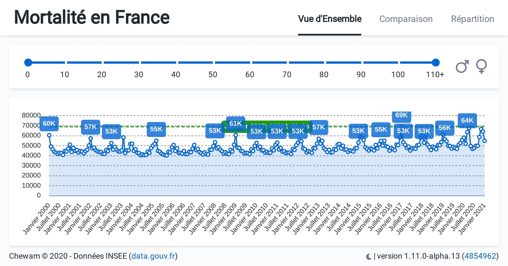

# deaths.chewam.com

A web page to show statistics about deaths in France from year 2000 up to now, based on [INSEE data](https://www.data.gouv.fr/fr/datasets/fichier-des-personnes-decedees/).



## Install
### Install dependencies

```bash
yarn
```
## Development
### Run development version

```bash
yarn dev
```

Open [http://localhost:3000](http://localhost:3000) with your browser to see the result.

## Tests
### Run code linter

```bash
yarn lint
```

### Run types check

```bash
yarn type-check
```

### Run tests

```bash
yarn test
```

## Built version
### Build application

```bash
yarn build
```

### Run built version

```bash
yarn start --port 3001
```

Open [http://localhost:3001](http://localhost:3001) with your browser to see the result.

### Analyze Built version

```bash
yarn analyze
```

## Update datasets

### Download and process data files

```bash
yarn update-data
```
---

[](https://github.com/chewam/deaths/actions?query=workflow%3AQuality) &nbsp; [](https://github.com/chewam/deaths/actions?query=workflow%3ARelease) &nbsp; [](https://github.com/chewam/deaths/actions?query=workflow%3ACodeQL) &nbsp; [](https://sonarcloud.io/summary/new_code?id=chewam_deaths)
