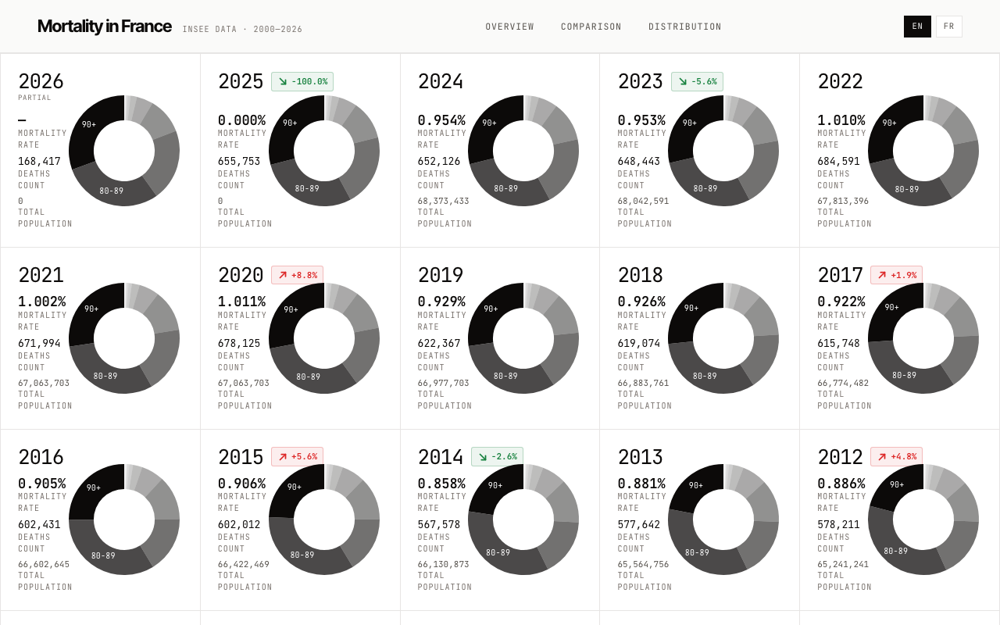

# deaths.chewam.com

A web page showing French mortality statistics from 2000 onward, based on [INSEE data](https://www.data.gouv.fr/fr/datasets/fichier-des-personnes-decedees/).

Live: <https://deaths.chewam.com>



## Stack

| Area      | Tech                                                  |
| --------- | ----------------------------------------------------- |
| Framework | [Next.js 15](https://nextjs.org/) (Pages Router)      |
| UI        | [React 19](https://react.dev/)                        |
| Language  | [TypeScript 5](https://www.typescriptlang.org/)       |
| Styling   | [Tailwind CSS 4](https://tailwindcss.com/)            |
| Charts    | Inline SVG (custom, no third-party chart lib)         |
| i18n      | [react-intl](https://formatjs.io/) — EN / FR          |
| Unit      | [Vitest](https://vitest.dev/)                         |
| E2E       | [Playwright](https://playwright.dev/) (behavior + visual) |
| Perf      | [Lighthouse CI](https://github.com/GoogleChrome/lighthouse-ci) |
| Errors    | [Sentry](https://sentry.io/)                          |

## Install

```bash
yarn
```

## Development

```bash
yarn dev
```

Open <http://localhost:3000>.

## Tests

Three nets guard against regressions:

```bash
yarn test         # Vitest — unit tests on business logic (filters, calculations)
yarn e2e          # Playwright — golden-path behavior on the 4 routes
yarn e2e:visual   # Playwright — pixel-perfect screenshots vs baselines
```

Static checks:

```bash
yarn lint         # ESLint
yarn type-check   # tsc --noEmit
```

## Accessibility & Performance

- **a11y**: zero `axe-core` violations on the 4 routes (`/`, `/overview`, `/comparison`, `/distribution`); WCAG AA contrast on the graphite palette.
- **perf**: Lighthouse ≥ 0.9 on Performance / Accessibility / Best Practices / SEO for every route. Reproduce with `yarn lhci`. Baseline tracked in [`docs/perf.md`](docs/perf.md).

## Internationalisation

User-facing strings go through `react-intl` (`<Trans id="…">`). Keys live in [`src/lang/en.json`](src/lang/en.json) and [`src/lang/fr.json`](src/lang/fr.json) — keep the two files in parity.

## Build

```bash
yarn build
yarn start --port 3001     # serve the production build
yarn analyze               # bundle analyzer
```

## Update datasets

```bash
yarn update-data
```

---

[](https://github.com/chewam/mortality/actions?query=workflow%3AQuality) &nbsp; [](https://github.com/chewam/mortality/actions?query=workflow%3ARelease) &nbsp; [](https://github.com/chewam/mortality/actions?query=workflow%3ACodeQL) &nbsp; [](https://sonarcloud.io/summary/new_code?id=chewam_deaths)
